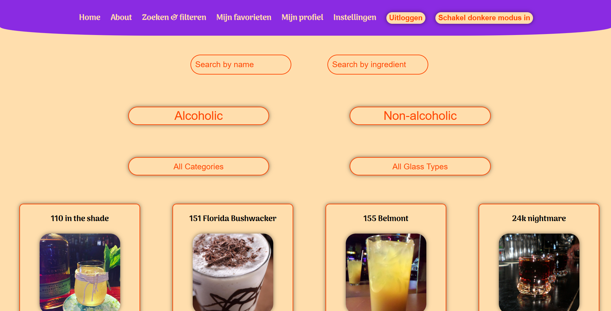
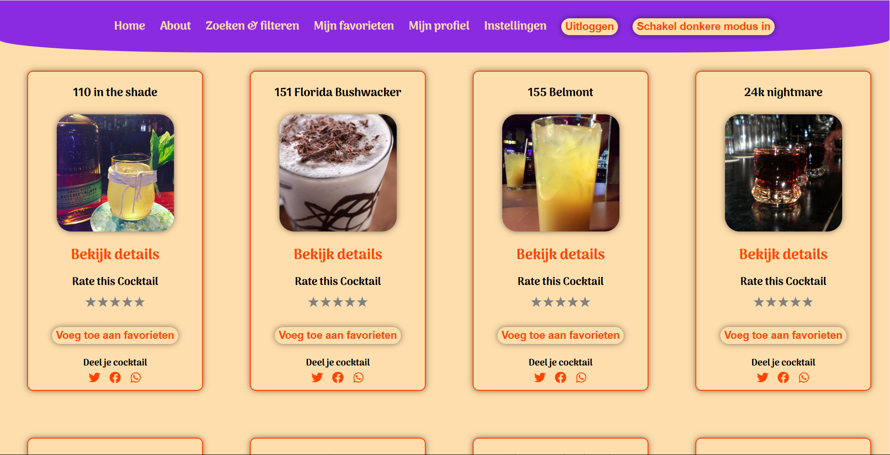

# Cocktail Applicatie - Installatiehandleiding

Welkom bij de Cocktail Applicatie! Deze applicatie stelt gebruikers in staat om cocktails te ontdekken, favoriete cocktails op te slaan, cocktails te beoordelen en zelfs quizzen te maken over hun cocktailkennis. Volg deze handleiding om de applicatie correct te installeren en te gebruiken.

## Inhoud

* Beschrijving van de functionaliteit
* Benodigdheden
* Installatie-instructies
* Authenticatie en accounts
* Gebruik van API-sleutels
* Overige npm-commando's
* Screenshots van de belangrijkste pagina


1. # Beschrijving van de functionaliteit


### De Cocktail Applicatie biedt de volgende kernfunctionaliteiten:

#### Cocktailverkenning:
Ontdek nieuwe cocktails, zoek en filter op naam, ingrediënten of alcoholisch/niet-alcoholisch.

#### Favorieten opslaan:
Sla favoriete cocktails op en beheer ze eenvoudig via een overzichtspagina.

#### Cocktailbeoordelingen:
Beoordeel cocktails en voeg persoonlijke notities toe.

#### Quiz:
Test je cocktailkennis met een leuke en interactieve quiz.

### Hieronder vind je een voorbeeld van een belangrijke pagina uit de applicatie:


## 2. Benodigdheden

###    Om de applicatie lokaal te draaien, heb je de volgende tools nodig:

- Node.js (versie 16 of hoger)
- npm (Node Package Manager)
- Een editor zoals VS Code
- Een API-sleutel van TheCocktailDB API (gratis registratie nodig)

## 3. Installatie-instructies

Volg deze stappen om de applicatie te installeren:

### Repository klonen 

Clone de repository naar je lokale machine:

```bash

git clone https://github.com/jouw-gebruikersnaam/cocktail-app.git

```

```bash

cd cocktail-app

```

# NPM-installatie 

Installeer de benodigde afhankelijkheden:

```bash

npm install

```

### API-sleutel instellen: 

Maak een bestand genaamd .env in de root van je project en voeg hierin je API-sleutel toe:

REACT_APP_COCKTAIL_API_KEY=JOUW_API_SLEUTEL

### Applicatie starten Start de ontwikkelserver:

```bash

npm start

```

De applicatie zal beschikbaar zijn op http://localhost:3000.


## 4. Authenticatie en accounts

### Registreren:

   1. Navigeer naar de Registreren-pagina via de navigatiebalk.
   2. Vul je gebruikersnaam, e-mailadres en een sterk wachtwoord in.
   3. Klik op "Registreren".
   4. Je kunt nu inloggen met je nieuwe account.
   
### Inloggen:

   1. Ga naar de Inloggen-pagina.
   2. Vul je geregistreerde e-mailadres en wachtwoord in.
   3. Na succesvolle authenticatie wordt je doorgestuurd naar de homepage.

## 5. Gebruik van API-sleutels

De Cocktail Applicatie maakt gebruik van TheCocktailDB API. Volg deze stappen om een API-sleutel te verkrijgen:

1. Registreer een account bij TheCocktailDB.
2. Verkrijg je unieke API-sleutel via je profielpagina.
3. Voeg deze sleutel toe aan het .env-bestand zoals hierboven beschreven.

⚠️ Belangrijk: Deel nooit je API-sleutel in publieke repositories.

## 6. Overige npm-commando's

Naast npm start, kun je de volgende commando's gebruiken:

#### Builden voor productie:

```bash

npm run build

```

#### Linten en code formatteren:

```bash

npm run lint

```

#### Tests draaien:

```bash

npm test

```


## 7. Screenshot van de belangrijkste pagina

Hier is een voorbeeld van de Cocktail Search pagina:



